# README.md

태그: 산출물

# 주간일기

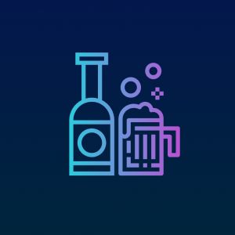

## 1. 프로젝트 소개

### 🍻 프로젝트 개요

> 프로젝트 팀명 : SSAFY 9기 부울경 E103 (주)오예스
프로젝트 기간 : 2023.10.10 ~ 2023.11.17
> 
> 
> 프로젝트 소개 : ‘술, 알고 먹자’. 건강하고 안전하게 술을 즐길 수 있도록 돕는 애플리케이션 ‘주간일기’입니다.
> 

**Google Play Store 링크**

[https://embed.notion-tools.com/block/imglink/?t=white&i=https://upload.wikimedia.org/wikipedia/commons/thumb/7/78/Google_Play_Store_badge_EN.svg/1280px-Google_Play_Store_badge_EN.svg.png&l=https://play.google.com/store/apps/details?id=com.official_ohyes.weeklivernote](https://embed.notion-tools.com/block/imglink/?t=white&i=https://upload.wikimedia.org/wikipedia/commons/thumb/7/78/Google_Play_Store_badge_EN.svg/1280px-Google_Play_Store_badge_EN.svg.png&l=https://play.google.com/store/apps/details?id=com.official_ohyes.weeklivernote)

### 💻 기획 배경

대한민국은 술과 친근한 문화를 가지고 있습니다. 우리는 특별한 날 뿐만 아니라, 평범한 날도 친구들과 가족들과 함께 술을 마시며 이야기를 나눕니다. 하지만 이러한 문화가 친밀감을 증진시키는 한편, 과음으로 인한 건강 문제를 야기하기도 합니다. 특히 연말연시와 같이 술자리가 빈번한 시기에는 더욱 그렇습니다. 이러한 상황에서 ‘주간일기’는 술을 즐기면서도 적절한 음주량으로 건강을 관리하고, 술에 대한 경각심을 가질 수 있도록 돕는 서비스를 만들자는 아이디어에서 출발하였습니다. 

### 🥅 프로젝트 목표

1. **사용자가 활용할 수 있는 다양한 정보 제공** : 사용자가 술을 마시더라도 그에 따른 영향을 정확히 인지하고, 이를 통해 건강하게 술을 마실 수 있도록 돕는 것을 목표로 합니다.
2. **서비스 배포 및 운영:** "주간일기" 서비스를 사용자들에게 배포하고, 원활한 서비스 운영을 통해 사용자들이 실제로 서비스를 사용해볼 수 있도록 합니다.
3. **서비스 개선 및 발전:** 사용자들이 서비스를 사용하면서 제공하는 피드백을 적극적으로 수집하고, 이를 분석하여 서비스 개선에 반영합니다. 사용자 피드백을 바탕으로 한 업데이트를 지속적으로 진행하여, 서비스를 발전시키는 것을 목표로 합니다.

## 2. 애플리케이션 기능 소개

### 🎈 주요기능 소개

1. **음주 기록 :** 실시간 기록 및 술케줄 달력에서의 과거 음주 기록 등을 통해 사용자는 자신의 술자리 및 마신 양을 기록할 수 있습니다.
2. **정보 제공:** 사용자가 마신 술의 양을 기록하면, 이를 바탕으로 혈중알코올 농도, 운전 가능 시간, 해독 시간 등의 정보를 계산하여 제공합니다. 미리 입력된 주량 데이터를 바탕으로 과음시 절주 알림을 제공합니다.
3. **통계 정보 제공:** 사용자의 술 소비 양과 패턴에 대한 다양한 통계를 제공하여, 사용자가 자신의 음주 습관을 이해하고 관리할 수 있도록 돕습니다.
4. **이동 정보 제공:** 막차 시간과 집까지의 최적 경로를 알려주어, 사용자가 안전하게 귀가할 수 있도록 돕습니다.

### 🔎 화면별 기능 소개

**회원가입 및 로그인**

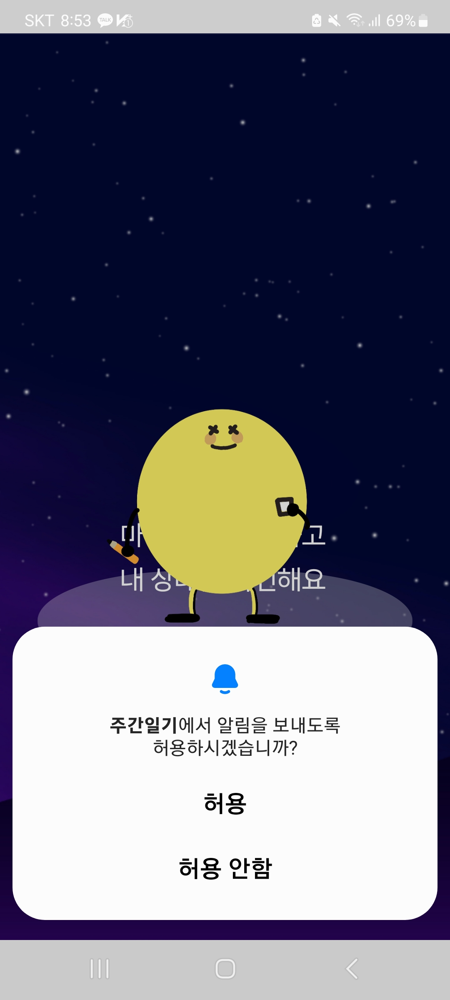

알림 및 위치정보 권한 허용 알림창이 뜨고, ‘허용’을 클릭합니다.


소셜 로그인(카카오 로그인)을 통해 어플에 회원가입 및 로그인을 진행합니다.

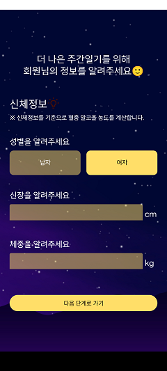

메인페이지 기능 사용을 위해 신체정보(성별,신장,체중)를 입력합니다.

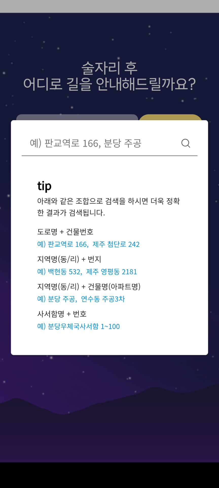

막차 및 귀가경로 조회 기능 사용을 위해 주소지를 입력합니다.

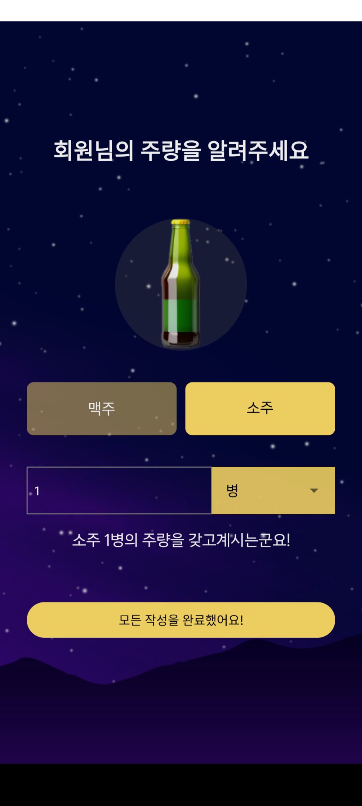

그만 마시세요 알림 기능을 위해 사용자 주량을 입력합니다.

**메인페이지**


사용자 주량의 절반이 넘은 경우, ‘벌써 주량의 절반을 마셨어요’알림이 발송됩니다.

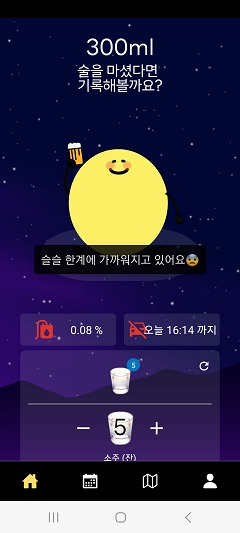

사용자 주량의 75%가 넘은 경우, ‘슬슬 한계에 가까워지고 있어요’알림이 발송됩니다.

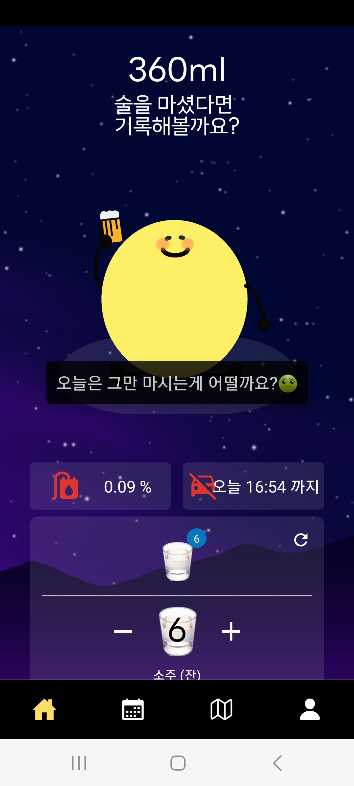

사용자 주량을 넘은 경우, ‘오늘은 그만 마시는게 어떨까요?’알림이 발송됩니다.

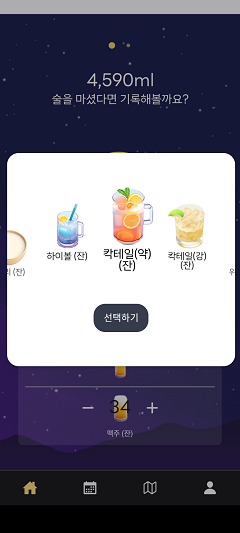

다양한 주종을 선택해 음주기록을 할 수 있습니다. 실시간 기록과 술력에서 기록할 때 모두 사용할 수 있습니다.

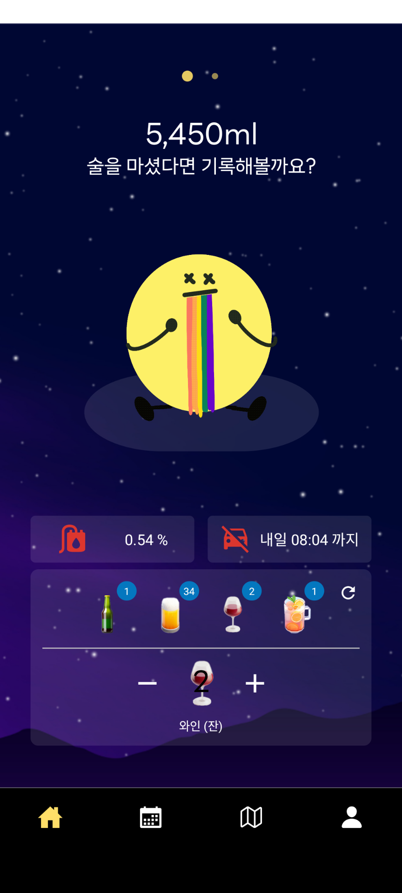

현재 기록할 주종의 종류를 바꾸면, 해당 주종 외 다른 주종의 음주량은 스탭퍼의 상단에서 확인할 수 있습니다.

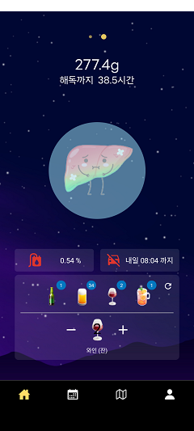

술을 마시기 시작한 시점(카운팅 시점)부터 간의 해독 시간을 알려줍니다.

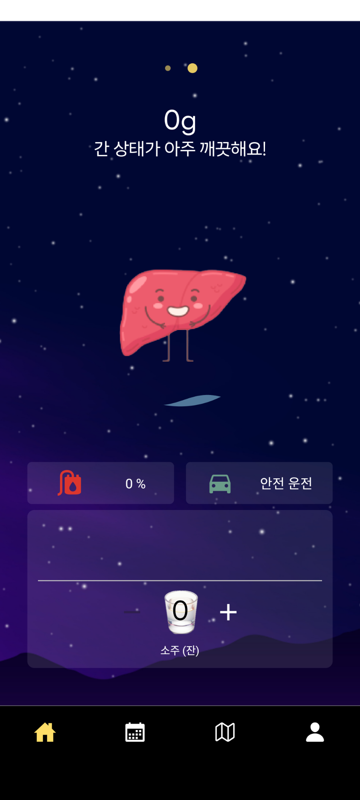

간을 둘러싸고 있는 수면은 해독시간이 지남에 따라 점차 수위가 낮아지고 완전히 해독된 시점에 간 캐릭터의 상태가 좋아집니다.

**캘린더**

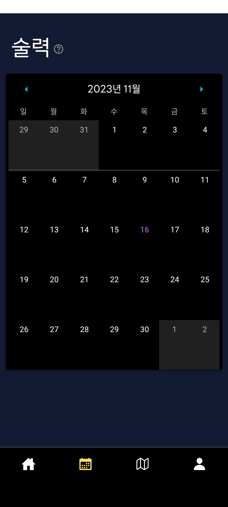

월간 음주 조회를 통해 월별로 술을 마신 날짜를 확인할 수 있습니다. 음주기록이 있는 날짜의 칸에는 아이콘이 표시됩니다.

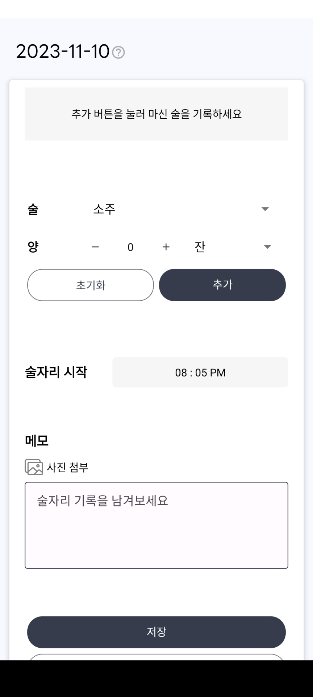

음주기록이 없는 날에는 이미 술자리가 끝난 자리에 대해 음주 기록을 남길 수 있습니다.

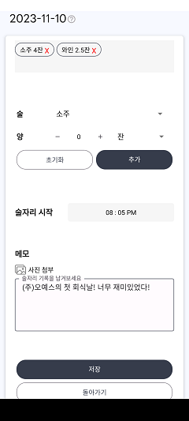

이미 기록이 있는 경우에는 음주 기록을 수정할 수 있습니다.

**막차조회**


막차 탭을 클릭합니다

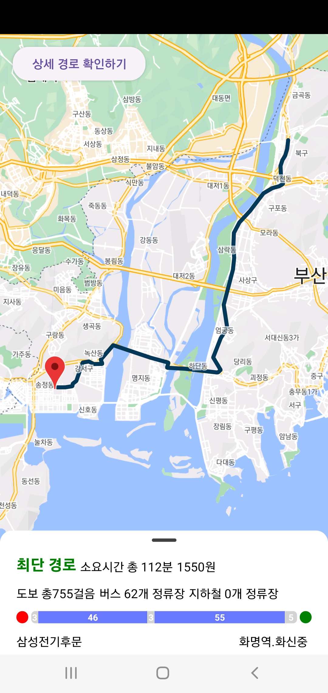

지도에 표시된 경로를 확인합니다.


집까지 가는 상세경로를 조회합니다.

**마이페이지**

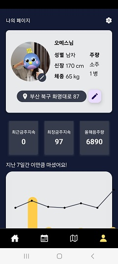

사용자는 마이페이지에서 프로필을 수정할 수 있습니다.

수정된 개인 정보로 혈중 알코올농도, 운전 가능 시간 등을 계산하며, 막차 조회시 요청하는 주소가 변경됩니다.

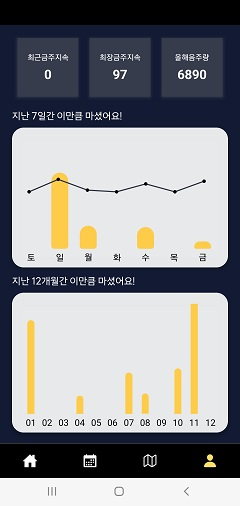

마이페이지에서 프로필 및 통계 차트를 확인합니다.

**설정**

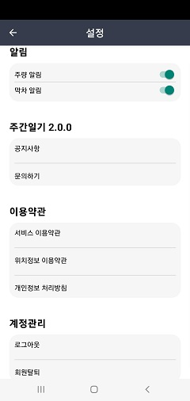

## 3. 개발 환경 및 사용한 기술

### 🔨 ****개발 언어 및 도구

- **FE**  `TypeScript(5.1.3)`, `Visual Studio Code(1.84.2)`
- **BE** `Spring boot(3.1.5)`, `IntelliJ(2023.2.5)`

### **🛠 사용한 라이브러리 및 프레임워크**

| 분류 | 기술 스택 |
| --- | --- |
| Common | Gerrit, Jira, GitLab, Notion, MatterMost, Discord, Figma, Git-Flow |
| Front-end | React Native(0.72.6), , expo(49.0.15), Node.js(18.16.1), yarn(1.22.19),  |
| Back-end | JDK(17), gradle(8.3), ORM (JPA), Spring Security, swagger(3) |
| CI/CD | AWS EC2, Nginx(1.18.0), Ubuntu(Ubuntu 20.04 LTS), Docker(24.0.6), Jenkins(2.414.3), Docker-compose(2.23.0) |
| Database | MySQL(8.0.34), Redis(7.2.3) |

### 🔧 **데이터베이스 및 서버 구성**

- 아키텍쳐 구조도

.png)

- ERD

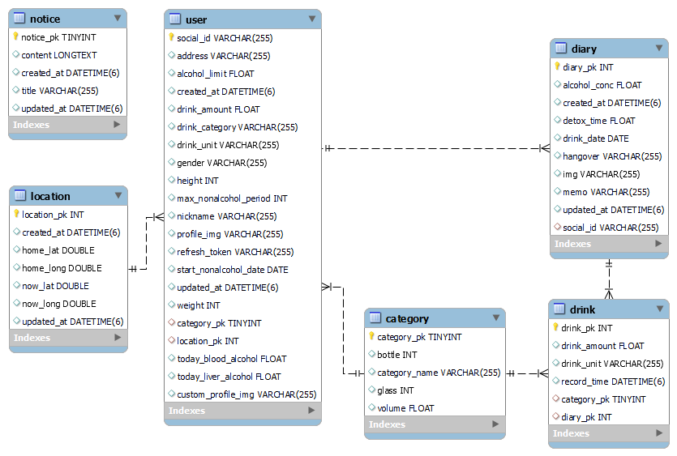

## API 명세서

[제목 없는 데이터베이스](assets/%E1%84%8C%E1%85%A6%E1%84%86%E1%85%A9%E1%86%A8%20%E1%84%8B%E1%85%A5%E1%86%B9%E1%84%82%E1%85%B3%E1%86%AB%20%E1%84%83%E1%85%A6%E1%84%8B%E1%85%B5%E1%84%90%E1%85%A5%E1%84%87%E1%85%A6%E1%84%8B%E1%85%B5%E1%84%89%E1%85%B3%20c4a6b2d673ea49f2858d71b6d9c64437.csv)

## Directory 구조도

**Front-end**

```bash
📁 SoolSool
├─ 📁 api
├─ 📁 assets
│  ├─ 📁 fonts
│  └─ 📁 Home
│     ├─ 📁 drinks
│     ├─ 📁 intoxication
│     └─ 📁 liver
├─ 📁 components
│  ├─ 📁 AddInfo
│  ├─ 📁 Calendar
│  ├─ 📁 Home
│  ├─ 📁 LastChance
│  ├─ 📁 EditProfile
│  └─ 📁 MyPage
│     └─ 📁 template
├─ 📁 recoil
├─ 📁 screens
│  └─ 📁 SettingsScreen
├─ 📁 data
├─ 📁 hooks
├─ 📁 models
└─ 📁 utils
```

**Back-end**

```bash
📁 src
    ├─ 📁 main
    │  ├─ 📁 java
    │  │  └─ 📁 com
    │  │      └─ 📁 ohyes
    │  │          └─ 📁 soolsool
    │  │              ├─ 📁 config
    │  │              │  └─ 📁 aop
    │  │              ├─ 📁 drink
    │  │              │  ├─ 📁 api
    │  │              │  ├─ 📁 application
    │  │              │  ├─ 📁 dao
    │  │              │  ├─ 📁 domain
    │  │              │  └─ 📁 dto
    │  │              ├─ 📁 gps
    │  │              │  ├─ 📁 api
    │  │              │  ├─ 📁 application
    │  │              │  └─ 📁 dto
    │  │              ├─ 📁 location
    │  │              │  ├─ 📁 api
    │  │              │  ├─ 📁 application
    │  │              │  ├─ 📁 dao
    │  │              │  ├─ 📁 domain
    │  │              │  └─ 📁 dto
    │  │              ├─ 📁 notice
    │  │              │  ├─ 📁 api
    │  │              │  ├─ 📁 application
    │  │              │  ├─ 📁 dao
    │  │              │  ├─ 📁 domain
    │  │              │  └─ 📁 dto
    │  │              ├─ 📁 user
    │  │              │  ├─ 📁 api
    │  │              │  ├─ 📁 application
    │  │              │  ├─ 📁 dao
    │  │              │  ├─ 📁 domain
    │  │              │  └─ 📁 dto
    │  │              └─ 📁 util
    │  │                  └─ 📁 jwt
    │  └─ 📁 resources
    └─ 📁 test
        └─ 📁 java
            └─ 📁 com
                └─ 📁 ohyes
                    └─ 📁 soolsool
```

## 4. 개발과정

- 프로젝트 일지
    
    
    | 구분 | 날짜 | 프론트엔드 | 백엔드 | 전체 |
    | --- | --- | --- | --- | --- |
    | [3주차] 개발1일차 | 2023-10-23(월) | - 프로젝트 생성 및 페이지 라우팅
    - [Mypage] 유저정보 aixos 호출  | - 프로젝트 생성
    - 스웨거, AOP ,시큐리티, cors 설정
    - 샘플코드 넣기
    - Docker, Docker compose 설정, Jenkins Docker 환경 구축, EC2 초기화 | - 게릿 초기 설정 : 깃랩 연동
    - 2차 교보재 신청 : 추가 서버 신청
    - 서비스명 채택 : 주간일기 |
    | [3주차] 개발2일차 | 2023-10-24(화) | - [Calender] react-native-calender 사용해서 기본 달력 구현
    - [Home] user상태 객체 생성, 로직 짜기
    - [MyPage] 배경화면 asset제작 및 컴포넌트 구조 설계 | - 음주 일지 POST api 구현
    - 소셜 로그인 흐름 공부
    - MySQL, Spring 관련 Docker 구축 | - 게릿 및 인프라 재설정
    - 디자인 컨셉 채택: 밤 분위기 |
    | [3주차] 개발3일차 | 2023-10-25(수) | - [Calendar] 기본 달력 폭 등 수정 진행 중…
    - [Home] user 상태에 따른 동적 이미지 렌더링
    - [Login] login 페이지 배경 설정 | - 음주 일지 UPDATE, DELETE api 구현
    - DB연관 관계 매핑
    - SSL 인증, 도메인 연결, Nginx 설정 | - 인프라 SSL 인증 완료 |
    | [3주차] 개발4일차 | 2023-10-26(목) | - axios 인스턴스 구현
    - 환경변수 설정
    - 캘린더 개별 일정 조회 컴포넌트 구조 설계 | - Category 컬럼 추가
    - User 관련 로직 추가
    - RequestBody 형식 및 swagger 문서 수정
    - 당일 음주 기록 요약 GET api 구현
    - 당일 음주 총계 GET api 구현 | - 백엔드 서버 배포 완료 |
    | [3주차] 개발5일차 | 2023-10-27(금) | - 이미지 에셋 생성 (술 아이콘 및 캐릭터)
    - [Home] 메인화면 캐러셀 구현 | - 월간 음주 기록 요약 GET api 구현
    - 일간 음주 기록 상세 GET api 구현
    - 날짜 관련 로직 수정 |  |
    | [3주차] 개발6/7일차 | 2023-10-28(토)
    2023-10-29(일) |  | - 백엔드 무중단 배포 설정 완료 |  |
    | [4주차] 개발 8일차 | 2023-10-30(월) | - [addInfo] 정보수집 3단계 페이지 생성 및 1단계 페이지 완료
    - [calender] 다른 달 날짜 선택 후 돌아가는 버그 수정 | - apk 파일 생성
    - 로그인 api 구현
    - 에러 메시지 반환
    - 공지사항 GET api 구현
    - S3 사진 업로드 및 삭제 구현 |  |
    | [4주차] 개발 9일차 | 2023-10-31(화) | - [addInfo] 정보수집 2단계, 3단계 페이지 생성, 주소창 만들기 시도중
    - [login] 로그인 페이지 완성 및 aixos 연동 성공
     | - 추가정보 조회 api 구현
    - 05시 일괄 처리 로직 구현 | - 대표색 및 디자인 확정(피그마)
    - 일정조정: 11/03(금) 심사 신청을 목표로 변경. |
    | [4주차] 개발 10일차 | 2023-11-01-(수) | - [all] font 설정 및 헤더 설정 통일
    - [nav] 내비게이션 설정 및 디버깅 | - 로그아웃, 회원탈퇴 api 구현
    - 알코올 농도, 해독 시간 계산 로직 수정
    - 모든 GET api 주종별로 합산되지 않는 에러 수정 |  |
    | [4주차] 개발 11일차 | 2023-11-02-(목) | - [Login] 첫회원과 아닌회원 구분하는 로직 작성
    - [Mypage] 주간그래프 axios 연동
    - [addInfo] 추가정보 등록 axios 연동
    - [Home] 메인 페이지 axios연동 및 실시간 입력값 반영
    - [settings] 설정 및 공지사항 페이지 작성  | - 타임존 이슈 날짜 관련 디버깅
    - api에 사용자 인증 추가 작업 |  |
    | [4주차] 개발 12일차 | 2023-11-03-(금) | - [All] 폰트 설치 및 전역 색상 변수 설정
    - [Home] 데이터 예외 처리 | - 유저 토큰 401 에러 처리
    - 토큰 인증 방식으로 변경
    - 앱 소개글 작성 |  |
    | [4주차] 개발 13/14일차 | 2023-11-04-(토)
    2023-11-05-(일) |  |  | - Play Store 심사 신청 |
    | [5주차] 개발 15일차 | 2023-11-06-(월) | - [Home] 버그 수정 및 UX 개선 (아이템 선택 시 모달 닫기, 컴포넌트 사용 가이드 제공)
    - [Widget] 사전 조사 → 폐기
     | - 막차 시간 관련 API 사전조사 및 테스트 | - 2차 기획 및 설계(막차, 알림, 위젯) 논의
    - 디자인 에셋 정리 및 피그마 작성
    - 원스토어 심사 신청 → 승인완료 |
    | [5주차] 개발 16일차 | 2023-11-07-(화) | - [Notification] 필요 라이브러리 설치 및 기초 설정 완료
    - [Home] 자잘한 버그 수정 및 예외 처리
    - [EditProfile] 회원정보수정 | - 로그인 api 버그 수정(추가정보입력 분기 해결)
    - 대중교통 길찾기 api 테스트 완료 |  |
    | [5주차] 개발 17일차 | 2023-11-08-(수) | - 추가정보 입력 페이지 버그 수정
    - 로그인 분기 처리
    - 전체 css 조정 | - 유저 주량 정보 반환값에 추가
    - User 테이블 주량 정보 컬럼 추가 및 socialId 데이터 타입 변경 (BIGINT → VARCHAR)
    - socialId 데이터 타입 변경으로 인한 긴급 에러 수정
    - Location 테이블 추가 | - Play Store 심사 통과 |
    | [5주차] 개발 18일차 | 2023-11-09-(목) | - 회원정보 수정 페이지 사진 추가 및 버그 수정
    - 마이페이지 통계 그래프 선그래프 수정 | - 대중교통 길찾기 API 호출
    - 최단 시간 경로 반환 로직 추가
    - 버스 막차 시간 조회 API 호출 | - Play Store, ONE Store 1차 업데이트 신청 및 승인 |
    | [5주차] 개발 19일차 | 2023-11-10-(금) | - BottomSheet 구현 | - 유저의 주소지 위도/경도 변환 후 저장
    - 지하철 막차 시간 조회 API 호출
    - 막차 30분 전 시간 계산
    - 당일 음주 전체 조회 반환값 수정 |  |
    | [5주차] 개발 20/21일차 | 2023-11-11(토)
    2023-11-12(일) | - [Home] 초기 소주 수량 반영 | - 알콜양 누적 05시 일괄 처리 추가 |  |
    | [6주차] 개발 22일차 | 2023-11-13-(월) | - [Home] 누적 알콜양 반영 / 주종 캐러셀 UX 개선 | - Redis 도입
    - 유저 프로필 사진 저장 기능 추가
    - 길찾기 에러 처리
    - 막차 정류장 반환값 추가 |  |
    | [6주차] 개발 23일차 | 2023-11-14-(화) | - [Home] 누적 알콜양 계산 로직 개선 및 디버깅 | - 유저 데이터 반환값 에러 수정
    - 당일 음주 요약 조회 내림차순 정렬 |  |
    | [6주차] 개발 24일차 | 2023-11-15-(수) | - [CSS] 마이페이지 CSS 조정 | - | UCC 촬영 |
    | [6주차] 개발 25일차 | 2023-11-16-(목) | - [CSS] 막차조회 페이지 CSS 조정 및 버그 수정
    - [Calendar] 음주량 및 알코올 통계 차트 변경 / 모달 스크롤 뷰 설정
    - [Home] 스크롤 뷰 CSS 적용
     | - 도착지 수정시 막차 경로 재조회 후 저장
    - 유저 통계 차트 label 값 수정 | - Play Store, ONE Store 2차 업데이트 신청 |

## 5. 프로젝트 멤버

<aside>
📌 **서이현(팀장)**


- Front-end
- tjwn1408@naver.com
- I-HYEON
</aside>

<aside>
📌 **김은비**


- Front-end
- eunbi.kim.kor@gmail.com
- yoon-b
</aside>

<aside>
📌 **박하윤**

.jpg)

- Back-end
- the.day0619@gmail.com
- hyoonpark
</aside>

<aside>
📌 **신세영(부팀장)**


- Back-end
- ssy07312@gmail.com
- SEYOUNGSHIN07312
</aside>

<aside>
📌 **유혜민**


- Infra, Back-end
- hyemco@gmail.com
- hyemco
</aside>

<aside>
📌 **이소정**


- Front-end
- chadireoroonu@gmail.com
- chadireoroonu
</aside>